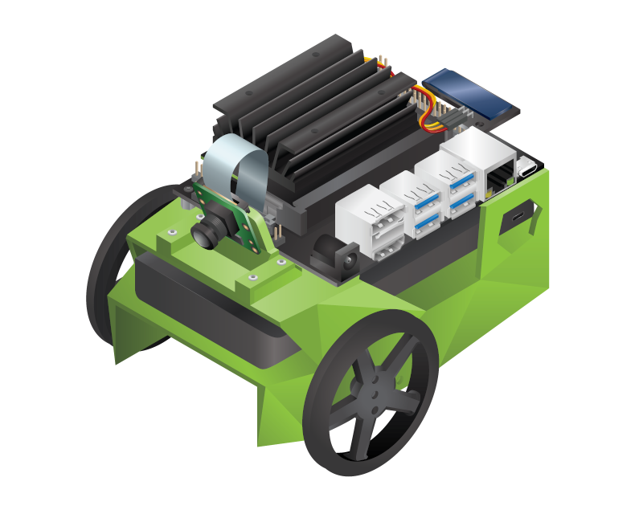

# JetBot

<!-- -->

JetBot is an open-source robot based on NVIDIA Jetson Nano.  You'll like
it because...

## It's Affordable

JetBot costs less than $250 in parts, *including* Jetson Nano. The DIY kit includes a bill of materials
which you must purchase and a 3D printed.  If you're looking to get
up and running as quick as possible, there are also many [third party kits](platform/third_party) available
that come pre-bundled.

## It's Educational

JetBot includes a set of tutorials which cover basic robotics concepts like programatic motor control, to more advanced topics like training a custom AI for avoiding collisions.  What you'll learn isn't limited to JetBot.  You'll learn concepts related to neural network data collection and training that extend as far as your imagination.

## It's Easy to Setup

JetBot is programmed from your web browser.  Just connect your JetBot to Wifi and launch the JetBot [Docker container](docker/README.md).  This enables JetBot's web programming environment, which is available even after the JetBot reboots.  Once your JetBot boots, just type it's IP address into your web browser and start programming.  

## It's Fun!

We built JetBot to make exploring ideas related to robotics as fun as possible.  In effect, it's a portable, battery powered
AI computer with a camera that's super easy to program.  This makes it the perfect platform for trying new ideas
related to AI, image processing and robotics.  Our experimentations have led us to new projects like [JetRacer](https://github.com/NVIDIA-AI-IOT/jetracer), 
and we're excited to see where your experimentation takes you.

##Get Started

To get started with JetBot, follow the [Quick Start](platform/README.md) instructions.

> If you run into any issues while working with JetBot, please [let us know](https://github.com/NVIDIA-AI-IOT/jetbot)!