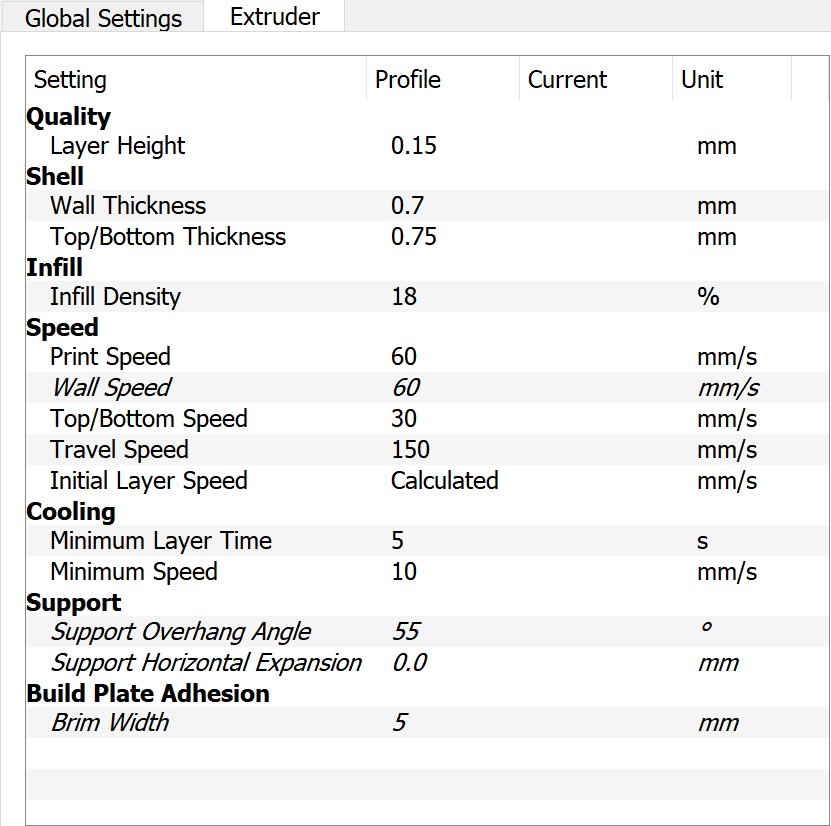

This page has useful information related to printing the JetBot chassis using a 3D printer.  There are two methods for printing JetBot

* Print by yourself
* Use a printing service

## Method 1 - Print by yourself

If you have a 3D printer, we recommend printing the JetBot components yourself!

### Print facts

Below are some facts related to printing a single JetBot.

* Print time:  10-12 hours
* Material used:  < 100 grams
* Material cost:  ~ $2

### Tested Printers

We've tested that the following printers are able to print JetBot successfully.

| Model | Cost | URL |
|------------|------|---|
| Monoprice Voxel | $320 | [Amazon](https://amzn.to/2GbUJ5Q) |
| Ultimaker 2+ | $2500 | [Amazon](https://amzn.to/2t8UDU0) |

### Tested Filaments

Based on our experience, we recommend using PLA filament when printing JetBot.  Below is a collection
of filaments that we have tested with the [Monoprice Voxel](https://amzn.to/2GbUJ5Q) 3D printer.

| Brand | Thickness | Material | Color | URL | Notes |
|-------|-----------|----------|-------|-----|-------|
| AmazonBasics | 1.75mm | PLA | Silver | [Amazon](https://amzn.to/2BkrKZP) | Smooth, dark metallic finish |
| AmazonBasics | 1.75mm | PLA | Neon Green | [Amazon](https://amzn.to/2HPg1YR) | Smooth, pale finish|
| AmazonBasics | 1.75mm | PLA | Yellow | [Amazon](http://amzn.com/B07D6CPFP4/) | Bold yellow, slightly translucent |
| AmazonBasics | 1.75mm | PLA | Purple | [Amazon](#) | Smooth, pale finish |

### Printing and slicing configuration

* STL unit: **mm**

* Print orientation

* Slice configuration (Cura)

## Method 2 - Use a printing service

If you don't have a 3D printer on hand, and are not interested in purchasing one, there are external services
that can print the chassis for you.  Below are some quotes from popular 3D printing services

> Please note, we have not tested these services yet ourselves, so please proceed with caution.  If you
> find a print service that worked well for you, we'd love to hear!  Please let us know by creating
> an issue on GitHub or mentioning it in the chat channel

| Service | Quote |
|---------|--------|
| [3DHubs](https://www.3dhubs.com/) | $36.66 |
| [Jinxbot](https://jinxbot.com/) | $91.42 |
| [Sculpteo](https://www.sculpteo.com/) | ~$100 |