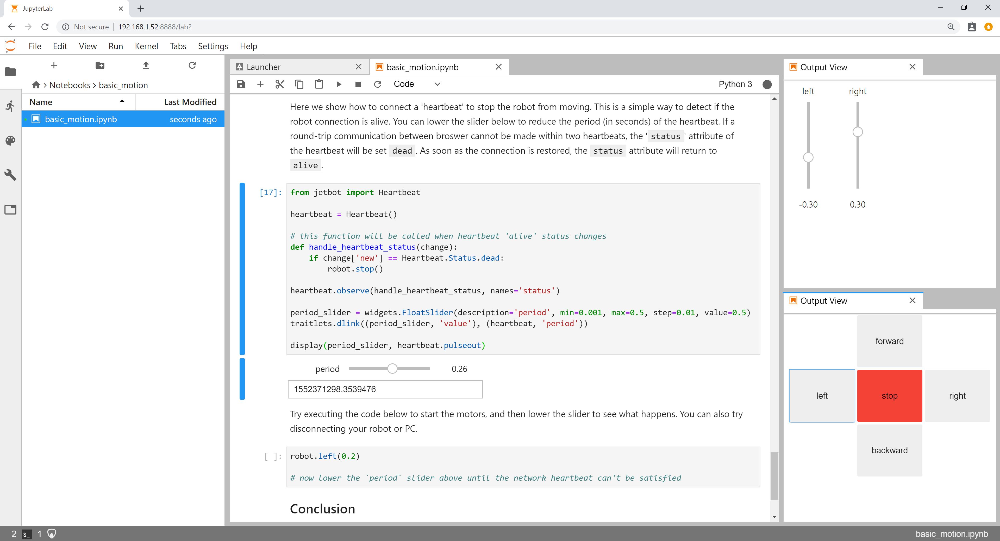
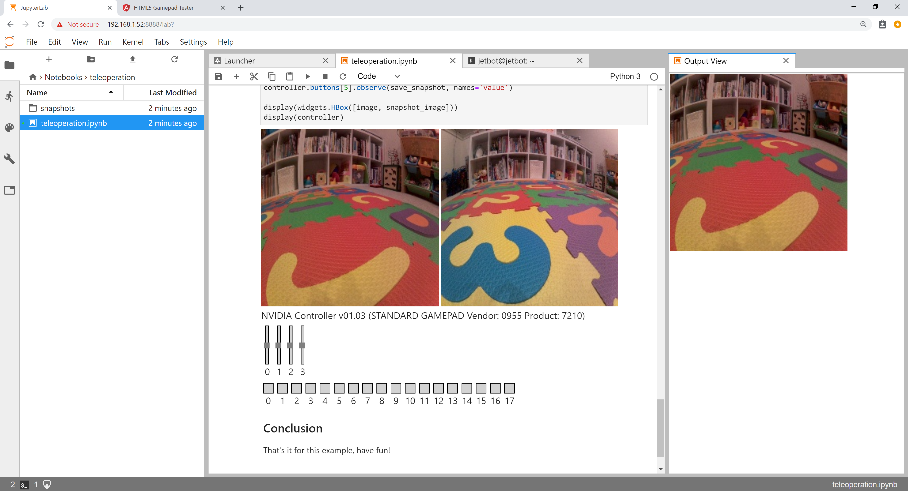
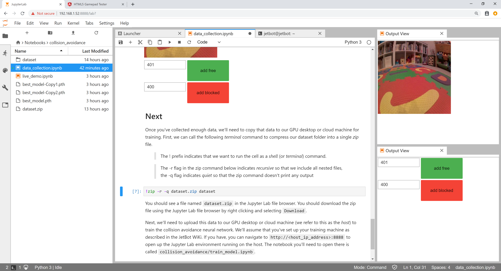
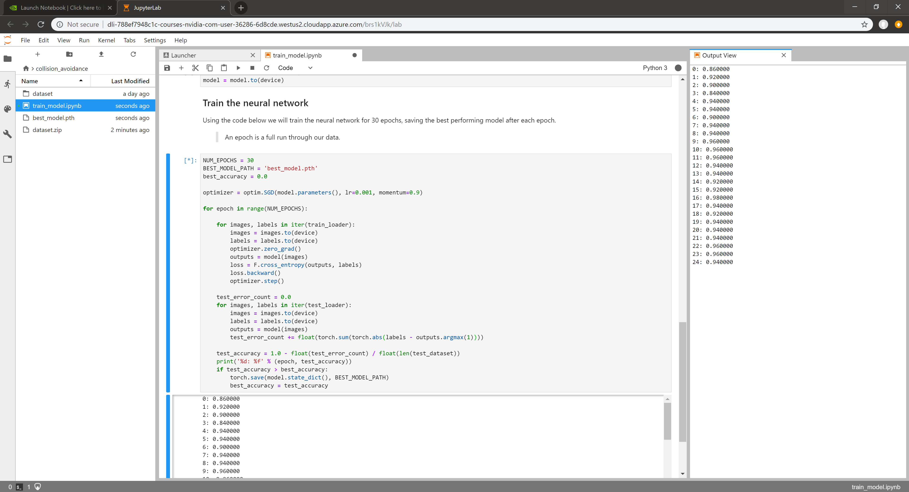
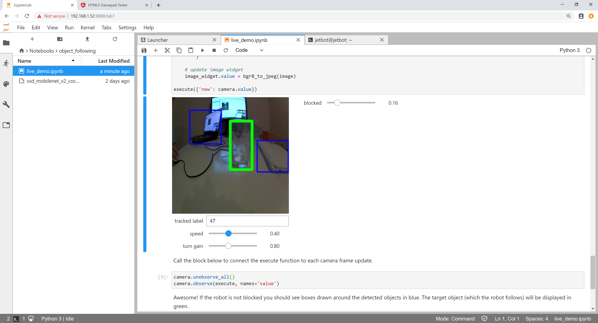

This page lists the examples provided with JetBot.

> Make sure your robot is connected to WiFi as described in the [software setup](software-setup)

### Example 1 - Basic Motion

In this example we'll control JetBot by programming from a web browser.

1. Connect to your robot by navigating to ``http://<jetbot_ip_address>:8888``

2. Sign in with the default password ``jetbot``
3. Navigate to ``~/Notebooks/basic_motion/``
4. Open and follow the [``basic_motion.ipynb``](../../jetbot/blob/master/notebooks/basic_motion/basic_motion.ipynb) notebook
    > Make sure JetBot has enough space to move around.

### Example 2 - Teleoperation

> This example requires a gamepad controller connected to your workstation.

In this example we'll drive JetBot remotely, view live streaming video, and save snapshots!

1. Connect to your robot by navigating to ``http://<jetbot_ip_address>:8888``

2. Sign in with the default password ``jetbot``
2. Shutdown all other running notebooks by selecting ``Kernel`` -> ``Shutdown All Kernels...``
3. Navigate to ``~/Notebooks/teleoperation/``
3. Open and follow the [``teleoperation.ipynb``](../../jetbot/blob/master/notebooks/teleoperation/teleoperation.ipynb) notebook

### Example 3 - Collision avoidance

In this example we'll collect an *image classification* dataset that will be used to help keep
JetBot safe!  We'll teach JetBot to detect two scenarios ``free`` and ``blocked``.  We'll use this AI classifier to prevent JetBot from entering dangerous territory.

#### Step 1 - Collect data on JetBot

> We provide a [pre-trained model](https://drive.google.com/open?id=1UsRax8bR3R-e-0-80KfH2zAt-IyRPtnW) so you can skip to step 3 if desired.  This model was trained on a limited dataset using the Raspberry Pi V2 Camera with wide angle attachment.

1. Connect to your robot by navigating to ``http://<jetbot_ip_address>:8888``

2. Sign in with the default password ``jetbot``
2. Shutdown all other running notebooks by selecting ``Kernel`` -> ``Shutdown All Kernels...``
3. Navigate to ``~/Notebooks/collision_avoidance/``
4. Open and follow the ``data_collection.ipynb`` notebook

#### Step 2 - Train neural network

##### Option 1 - Train on Jetson nano
1. Shutdown your robot and remove the micro USB power cable.

2. Power the Jetson Nano by using the 5V wall power supply.
3. Connect to your robot by navigating to ``http://<jetbot_ip_address>:8888``
4. Sign in with the default password ``jetbot``
5. In the Jupyter Lab tab, navigate to ``~/collision_avoidance``
6. Upload the collision avoidance [training notebook](../../jetbot/blob/master/notebooks/collision_avoidance/train_model.ipynb) to this folder
7. Open and follow the ``train_model.ipynb`` notebook

##### Option 2 - Train on other GPU machine
1. Connect to a GPU machine with PyTorch installed and a Jupyter Lab server running

2. Upload the collision avoidance [training notebook](../../jetbot/blob/master/notebooks/collision_avoidance/train_model.ipynb) to this machine
3. Open and follow the ``train_model.ipynb`` notebook

#### Step 3 - Run live demo on JetBot

1. Power your robot from the USB battery pack

2. Connect back to your robot by navigating to ``http://<jetbot_ip_address>:8888``
3. Sign in with the default password ``jetbot``
4. Shutdown all other running notebooks by selecting ``Kernel`` -> ``Shutdown All Kernels...``
5. Navigate to ``~/Notebooks/collision_avoidance``
6. Open and follow the ``live_demo.ipynb`` notebook
    > Start cautious and give JetBot enough space to move around.

#### Video

This video shows multiple JetBots running collision avoidance

### Example 4 - Object Following

In this example we'll have JetBot follow an object using a pre-trained model capable of detecting common objects like``Person``, ``Cup``, and ``Dog``.  While doing this, JetBot will run the collision avoidance model from Example 3 to make sure it stays safe!

1. Connect to your robot by navigating to ``http://<jetbot_ip_address>:8888``

2. Shutdown all other running notebooks by selecting ``Kernel`` -> ``Shutdown All Kernels...``
3. Navigate to ``~/Notebooks/object_following/``
4. Upload the pre-trained [ssd_mobilenet_v2_coco.engine](https://drive.google.com/open?id=1RnNBHPDphIOWwHCSfeMCWQ7XN3w3tKFD) model to this folder
    > Also make sure the collision avoidance model from Example 3 is in ``~/Notebooks/collision_avoidance``
4. Open and follow the ``live_demo.ipynb`` notebook
    > Start cautious and give JetBot enough space to move around.

#### Video

This video shows JetBot following a person and avoiding obstacles

## Next

Make JetBot smarter

* Collect more collision avoidance data
* Try out different neural network architectures (the [torchvision](https://pytorch.org/docs/stable/torchvision/models.html) package has lots!)
* Modify the collision avoidance example for a new task (ie: ``cat`` / ``no cat``.  if ``cat`` then ``run``)

Create something entirely new!

* Modify the collision avoidance example for your own project
* Try out some new hardware with Jetson Nano.  It's easy with Jetson GPIO and [Adafruit Blinka](https://blog.adafruit.com/2019/03/18/adafruit-blinka-support-for-the-nvidia-jetson-series-nvidia-gtc19-nvidiaembedded/)

Share it with us

* [NVIDIA Developer Forums](https://devtalk.nvidia.com/default/board/372/jetson-projects/)

