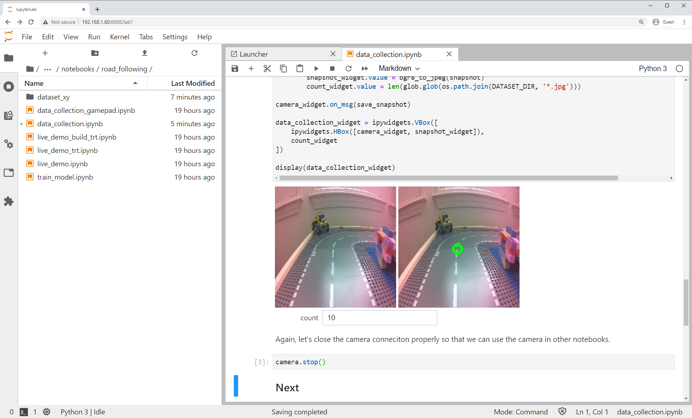

# Road Following

In this example we'll collect an *image regression* dataset that will enable JetBot to follow a road!  We'll teach JetBot to detect a target ``x, y`` image coordinate that the JetBot will chase.  As JetBot gets closer to the point, it moves further along the track.

#### Step 1 - Collect data on JetBot

1. Connect to your robot by navigating to ``http://<jetbot_ip_address>:8888``
2. Sign in with the default password ``jetbot``
2. Shutdown all other running notebooks by selecting ``Kernel`` -> ``Shutdown All Kernels...``
3. Navigate to ``~/Notebooks/road_following/``
4. Open and follow the ``data_collection.ipynb`` notebook

#### Step 2 - Train neural network

##### Option 1 - Train on Jetson Nano
1. Connect to your robot by navigating to ``http://<jetbot_ip_address>:8888``
2. Sign in with the default password ``jetbot``
3. In the Jupyter Lab tab, navigate to ``~/Notebooks/road_following``
4. Open and follow the [``train_model.ipynb``](https://github.com/NVIDIA-AI-IOT/jetbot/blob/master/notebooks/road_following/train_model.ipynb) notebook

##### Option 2 - Train on other GPU machine
1. Connect to a GPU machine with PyTorch installed and a Jupyter Lab server running

2. Upload the road following avoidance [training notebook](https://github.com/NVIDIA-AI-IOT/jetbot/blob/master/notebooks/road_following/train_model.ipynb) to this machine
3. Open and follow the ``train_model.ipynb`` notebook

#### Step 3 - Optimize the model on Jetson Nano

1. Connect to your robot by navigating to ``https://<jetbot_ip_address>:8888``
2. Sign in with the default password ``jetbot``
3. Shutdown all other running notebooks by selecting ``Kernel`` -> ``Shutdown All Kernels...``
4. Navigate to ``~/Notebooks/road_following``
5. Open and follow the ``live_demo_build_trt.ipynb`` notebook to optimize the model with TensorRT

#### Step 4 - Run live demo on JetBot

1. Connect to your robot by navigating to ``http://<jetbot_ip_address>:8888``
2. Sign in with the default password ``jetbot``
3. Shutdown all other running notebooks by selecting ``Kernel`` -> ``Shutdown All Kernels...``
4. Navigate to ``~/Notebooks/road_following``
5. Open and follow the ``live_demo_trt.ipynb`` notebook to run the optimized model

???+ warning
    Start cautious and give JetBot enough space to move around.
