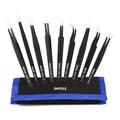
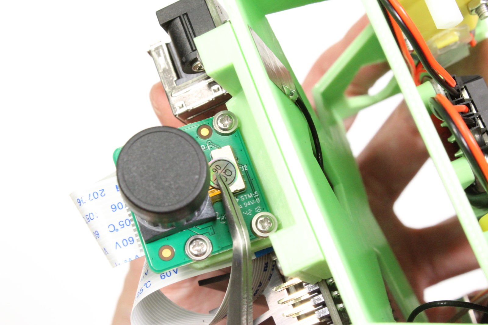

This page details the hardware setup instructions for creating JetBot

## Tools needed

To build JetBot you'll need the following tools

* Pliers

* Wire flush cutters/wire stripper
* Phillips screwdriver (+ [Hex screwdriver for M2 hex socket screws](https://amzn.com/B00CP2GGBI/) )
* Soldering iron and solder
* (optional) [Precision Electronics Tweezers](https://amzn.to/2t4AWg7)

## Assembly

### Step 1 - Clean 3D printed parts

1. Remove support material from motor sockets using pliers

2. Remove support material from all surfaces, openings and screw holes using pliers, tweezers, and/or fingernails
3. File material from openings if they are too tight

### Step 2 - Mount motors

1. Cut and remove the zip tie from each motor

2. Tuck the wires beneath transparent band to prevent stress on solder joints
3. Insert each motor into the 3D printed chassis
4. Secure each motor with 2x M3x25mm screws

### Step 3 - Solder motor driver

1. Break away 3-pin and 2-pin male headers from header link that comes with motor driver package

2. Join two of the screw terminal blocks to create a 4-pin screw terminal
3. Solder the 2-pin and 4-pin screw terminals to motor driver
4. Solder the 2-pin and 3-pin male headers to motor driver

    ???+ warning  
        Pay careful attention to the position of the 3-pin header.  It is offset by 1-pin from the corner.

### Step 4 - Strip motor driver power cable

1. Select the depicted micro USB from the pack 

    ???+ warning
        Pay careful attention to the image.  The cables are not identical.  
        The other micro USB cable will be used to power the Jetson Nano.  Using the wrong power cable for Nano will block it's Ethernet port.

2. Cut the depicted cable roughly ~20cm from the type-A terminal
2. Strip the rubber coating ~3cm from the cut
3. Remove the green / white wires and metal shielding.
4. Strip the red and black wires about ~5mm from cut
5. (optional) Twist the exposed strand wire and coat with solder

### Step 5 - Mount motor driver 

1. Route the spliced cable through chassis

2. Secure exposed red (+) and black (-) wires to the power terminals on motor driver

    ???+ warning
        Pay attention to the markings on the motor driver.  Incorrect wiring could damage the driver.

3. Route the spliced cable under the motor driver to organize and prevent stress on screw terminal
4. Secure motor driver to chassis using self taping screws
5. Secure left and right motor wires to motor screw terminals

    ???+ info
        ***Notice (3/11/2019):*** We made a slight mistake: the red and black wires for the left and right motor are actually flipped in the image shown above.  This will not cause damage, but the motors will spin backwards.  Please flip them to the correct orientation.

### Step 6 - Mount WiFi antennas

!!! attention ""

    Skip this step if you are using a USB WiFi dongle instead of the M.2 WiFi module

1. Secure one patch antenna to the underside of top plate

2. Secure the other patch antenna at edge of battery bay
3. Route connectors as shown

### Step 7 - Remove Jetson Nano module from developer kit

!!! attention ""

    Skip this step if you are using a USB WiFi dongle instead of the M.2 WiFi module

1. Remove standoff screws from Jetson Nano module

2. Release the side latches of SODIMM connector using hands
3. Slide Jetson Nano module out of SODIMM connector

### Step 8 - Attach WiFi module to developer kit

!!! attention ""

    Skip this step if you are using a USB WiFi dongle instead of the M.2 WiFi module

1. Attach developer kit to chassis using self taping screws

2. Snap antennae on to WiFi module using fingers
3. Remove the screw from developer kit by the M.2 socket
4. Insert WiFi module into M.2 slot on developer kit
5. Fasten WiFi module to developer kit with screw removed in (3)
6. Re-attach the Jetson Nano module to developer kit

### Step 9 - Mount ball caster

1. Place the caster ball inside of shroud

2. Insert the caster base into shroud, securing the ball

    ???+ tip 
        Depending on how the print turns out, the ball socket enclosure may fit too tight. If this is the case, you can easily use a file to remove some excess material.

3. Attach the assembled caster onto the chassis with self taping screws

### Step 10 - Solder header onto *PiOLED* display

1. Secure the 6-pin right angle header to PiOLED display by some method

2. Solder the pins depicted (3.3V, SDA, SCL, and GND solder seen when zoomed in on right image)

    ???+ warning
        The pins are close to the display screen, be careful to avoid the screen with soldering iron tip. 

### Step 11 - Wire motor driver to *PiOLED* display

1. Select 4 wire segment of female-female jumper cables.

    ???+ info
        We use brown, red, orange, yellow segment.  You can map the colors accordingly.

2. Attach 3.3V (red), GND (brown), SDA (orange), and SCL (yellow) to motor driver as shown
3. Route the 4 wire jumper cable segment through chassis
4. Attach red, brown, orange and yellow wires to right angle header as depicted

    ???+ warning 
        Pay close attention!  Reversing the red / brown wires could damage the system.

### Step 12 - Mount camera

1. Attach the camera to the camera mount using 4x self tapping screws

2. Attach the camera mount to chassis with 4x self tapping screws
3. Insert the other end of ribbon cable into Jetson Nano developer kit
4. (optional) Tuck the ribbon cable against heat sink to organize

### Step 13 - Attach wide angle sensor

1. Peel off the original camera sensor

2. Remove any excess adhesive material
3. Remove the adhesive film cover from wide angle replacement sensor
4. Attach wide angle replacement sensor to camera module
5. Ensure the sensor connector is fastened to camera module

### Step 14 - Mount battery

1. Attach double sided adhesive tabs to each end of battery, leaving some tab exposed

2. Holding robot upside down, slide battery into battery bay
3. Holding the battery in place, flip the robot and secure battery to chassis

### Step 15 - Organize wires

1. Route USB cables through chassis to organize and prevent dragging

## Finished JetBot

Once finished, your JetBot should look similar to this.

