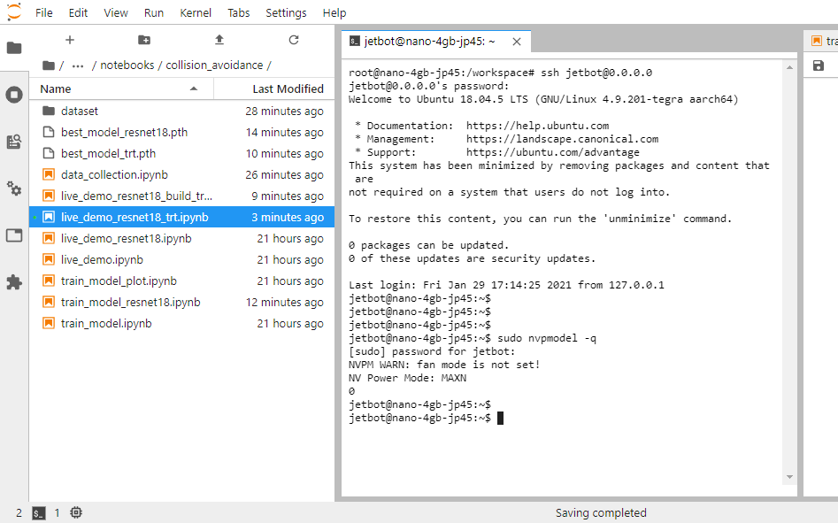

# Docker Tips

This page provides various information related to using docker with JetBot.

## Establishing access to the Docker host terminal

The Jupyter Lab is running in the Docker container, thus the **Terminal** you open on Jupyter Lab only have access to the container environment.<br>
This means you cannot use commands like `nvpmodel`, `tegrastats`, `journalctl`, `systemctl` and others.

To get around this limitation, you can actually SSH in to the Docker host machine by;

```
ssh jetbot@0.0.0.0
```



## Using Nvidia GPU Cloud (NGC)

The standard JetBot containers are hosted on docker hub, but for development or testing purposes, you may wish to use Nvidia GPU Cloud. To access containers on NGC, you need to sign into the NGC registry. To do this:

1. Log into ngc.nvidia.com

2. Generated your API Key

    1. Navigate to Setup > API Key
    2. Click on "Generate API Key" at the right upper corner of the page
    3. Copy the API key for future use

3. On your Jetson, sign into the NGC registry using the generated key

    ```bash
    $ sudo docker login nvcr.io
    
    Username: $oauthtoken
    Password: <Your Generated Key>
    ```

For the username, enter `$oauthtoken` exactly as shown. It is a special authentication token for all users.


## Using custom Jupyter Lab workspace directory

The argument you provide to the enable.sh script is mounted as a volume inside the docker container. Inside the docker container, this volume is located at /workspace. Any changes that you make inside this directory will be saved outside of the docker container. To use a different directory as the workspace for the Jupyter contianer, just provide the path as an argument when calling enable.sh. For example, to set the workspace to your home directory, you would do

```bash
cd jetbot/docker
./enable.sh $HOME
```

## Disabling containers

Once you execute the `enable.sh` script, the containers are set to restart automatically.
This means you can shut down your Jetson, and when you reboot the containers will run and you don't need to repeat this process. 

To prevent the containers from starting automatically, just call the disable.sh script.

```bash
cd ~/jetbot/docker
./disable.sh
```

