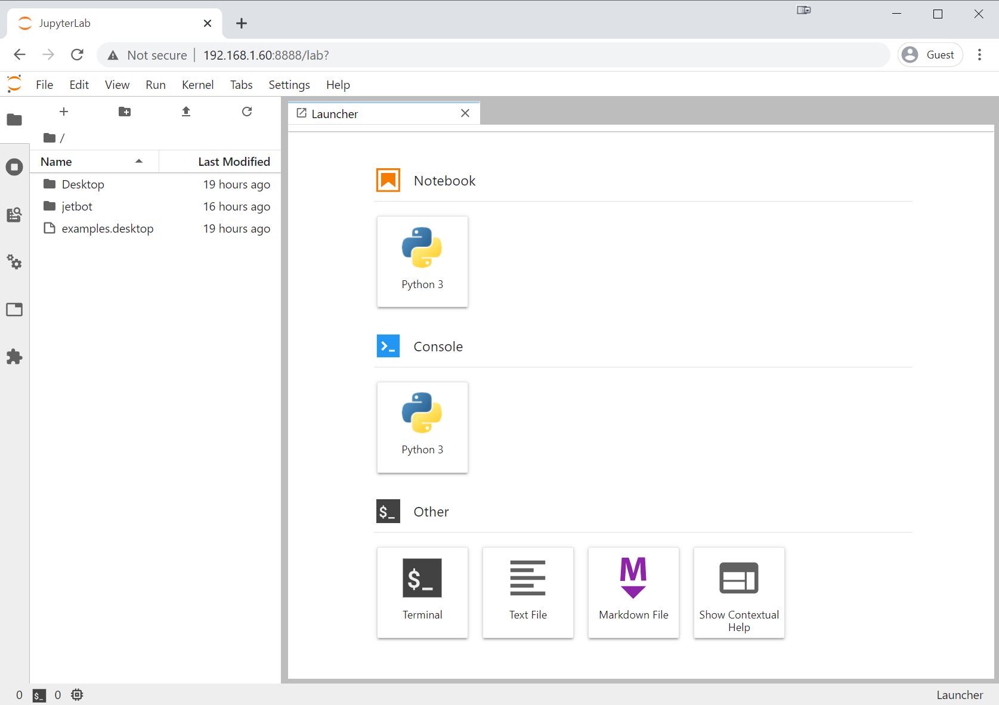

# Software Setup (Docker)

This page details how to set up JetBot using the pre-built JetBot docker containers. This is the best option if you want to use JetBot with an existing Jetson Nano SD card image.

???+ note
    Please note, the JetBot containers described in this page currently target a Jetson Nano SD card image flashed with JetPack 4.4. These containers will not work with other version of JetPack.


## Step 1 - Setup Jetson Nano

If you haven't already, go through the initial setup of Jetson Nano.<br>
You can use your existing Jetson Nano set up (microSD card), as long as you have enough storage space left.

???+ hint
    For this, we'll assume you've set up your Jetson Nano using the **online Getting Started guide**.
        
     - [Getting Started With Jetson Nano Developer Kit](https://developer.nvidia.com/embedded/learn/get-started-jetson-nano-devkit)
     - [Getting Started with Jetson Nano 2GB Developer Kit](https://developer.nvidia.com/embedded/learn/get-started-jetson-nano-2gb-devkit)

## Step 2 - Connect to Wi-Fi

If you haven't already, connect your Jetson Nano to your Wi-Fi network.

Follow this [Wi-Fi setup](wifi_setup.md) guide.


## Step 3 - Clone JetBot repo

Clone the [official JetBot GitHub repo](https://github.com/NVIDIA-AI-IOT/jetbot).

```bash
git clone http://github.com/NVIDIA-AI-IOT/jetbot.git
```

## Step 4 - Configure System

First, call the [``scripts/configure_jetson.sh``](https://github.com/NVIDIA-AI-IOT/jetbot/blob/master/scripts/configure_jetson.sh) script to configure the power mode and other parameters.

```bash
cd jetbot
./scripts/configure_jetson.sh
```

???+ hint
    `configure_jetson.sh` also disables the GUI for the interest of saving system memory (DRAM) consumption.<br>
    If you want to re-enable the GUI, you can execute the following command.
    
    ```bash
    sudo systemctl set-default graphical.target
    ```
    
    Optionally, you can execute this script (`./scripts/re_enable_gui.sh`). 

Then, call the [``scripts/enable_swap.sh``](https://github.com/NVIDIA-AI-IOT/jetbot/blob/master/scripts/enable_swap.sh) script to enable swap memory if not set.<br>
Having extra 4GB swap memory is recommended even on Jetson Nano (4GB) Developer Kit.

```bash
./scripts/enable_swap.sh
```

## Step 5 - Enable all containers

Call the following to enable the JetBot docker containers 

```bash
cd docker
./enable.sh $HOME   # we'll use home directory as working directory, set this as you please.
```

Now you can go to ``https://<jetbot_ip>:8888`` from a web browser and start programming JetBot!

You can do this from any machine on your local network.  The password to log in is ``jetbot``.



The `enable.sh` script causes the docker containers to restart at boot. This means the next time you power on your JetBot, the containers will automatically start, and you should see the IP address displayed on the PiOLED display screen. All you need to do is type this into your web browser and start programming!

???+ tip
    For more information on configuring and using docker with JetBot, check out the [Docker Tips](../reference/docker_tips.md) page.
    
Now that you've finished setting up you're JetBot, you're ready to run through the [examples](../examples/basic_motion.md)!


