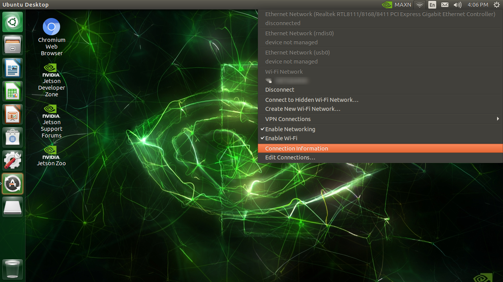
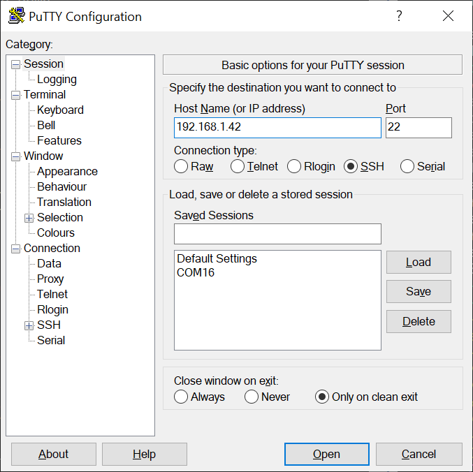

# Wi-Fi connection setup 

???+ info
    You can skip this page if you already have a wireless connection to your JetBot from your computer.

To go through the actual example applications on JetBot, you interact with JetBot from your (laptop) PC through Wi-Fi network.

This document explains how you can initially set up the Wi-Fi connection on your Jetson.

## Monitor-attached Mode

The easiest way to set up the Wi-Fi connection on your Jetson, is to operate on the GUI desktop.<br>
For this you need to fisrt connect the following to the Jetson on your JetBot.

- HDMI monitor
- USB keyboard
- USB mouse

With this setup, you can use Jetson like a standard Linux computer. <br>
We call this **Monitor-attached Mode**.

???+ hint
    If you don't have above items handy, then you can also try the headless way of configuring Wi-Fi.
    Head down to the next section, [Headless Mode](#headless-mode).


### Connect to Wi-Fi AP

If a Wi-Fi adaptor (either Intel 8265 M.2 card or a USB Wi-Fi dongle) is attached, you can configure the wireless network from the desktop.


### Check IP address

After the connection established, check the IP address.



Note this IP address.


### Verify the IP address

To test the IP address is valid and your Jetson is accesible, try connecting to the IP address from your separate (laptop) PC.

SSH server is enabled by default on Jetson.<br>
Open your SSH client software (PuTTY, etc) on your PC, and try to connect the SSH server on the IP address.



This is how you connect to your JetBot using SSH client software.<br>
Once you confirm you can connect to your Jetson remotely from your PC via Wi-Fi, **you can now remove the HDMI monitor, keyboard and mouse from Jetson**, and let your JetBot free!

And at this point, you are now using Jetson effectively in the Headless Mode.

??? hint
    Alternatively, even on the GUI deskop, you can open the terminal by pressing `Ctrl` + `Alt` + `T` keys, and follow the command-line based setup described below for headless setup.

    


## Headless Mode

When you put your Jetson in a deployed system, like a mobile robot, it is often difficult to attach an HDMI monitor.<br>
We can still control such Jetson remotely through network from a (laptop) PC, ***WHEN you already know the IP address***.<br>
We call this operation mode **Headless Mode**.

However you face a chiken-or-egg dillemna here, because you want to remotely login to the console to set up a Wi-Fi connection, but to do that you first need the IP address of your Jetson that you get after establishing the Wi-Fi connecton.

### USB Device Mode

What comes handy here is **USB Device Mode**.

You connect your (laptop) PC and Jetson using a Micro-USB cable. (Type-A end goes to your PC, Micro-B end goes to Jetson)<br>
Using this wired connection, you can access the terminal on Jetson from your (laptop) PC.

With USB Device Mode, Jetson presents 3 different USB Device Class end-points to the PC that it got connected to.<br>
They function as

- USB mass storage device (you see `L4T-README` drive mounted on your PC, like a USB thumbdrive)
- USB serial (like the common "FTDI" USB to serial adapter)
- USB network interface card (like a virtual Ethernet adapter)

With the virtual Ethernet adapter functinality, Jetson forms a virutal local Ethernet network with Jetson being `192.168.55.1` and your PC being `192.168.55.100`.
So you can actually SSH login from your (laptop) PC by specifying `192.168.55.1`, if you have already set up your acount (with username and password).

If you are using Jetson for the first time right after you flash your SD card, then you don't have this user account set up.<br>
In that case, you want to use the USB serial functinality, and use your serial terminal software on your PC to have accesss to the Jetson's serial terminal.

So either way, with a Micro USB cable, you can have an access to Jetson's terminal.


### Connect Wi-Fi using `nmcli` command

If a Wi-Fi adaptor (either Intel 8265 M.2 card or a USB Wi-Fi dongle) is attached, you can configure the wireless network using `nmcli` command.

You can first check if you want a wireless adapter on your system.<br>
Look for `wlan0`.

```bash
$ nmcli device
DEVICE  TYPE      STATE         CONNECTION
l4tbr0  bridge    connected     l4tbr0
wlan0   wifi      disconnected  --
eth0    ethernet  unavailable   --
dummy0  dummy     unmanaged     --
rndis0  ethernet  unmanaged     --
usb0    ethernet  unmanaged     --
lo      loopback  unmanaged     --
``` 

Then you can list all the wirelss networks (SSDI) in the area.

```bash
$ nmcli device wifi list
IN-USE  SSID                           MODE   CHAN  RATE        SIGNAL  BARS  SE
        --                             Infra  6     195 Mbit/s  82      ▂▄▆█  WP
        --                             Infra  6     195 Mbit/s  82      ▂▄▆█  WP
        --                             Infra  6     195 Mbit/s  75      ▂▄▆_  WP
        MY_WIFI_AP                     Infra  6     195 Mbit/s  70      ▂▄▆_  WP
        --                             Infra  6     195 Mbit/s  70      ▂▄▆_  WP
        *********                      Infra  1     405 Mbit/s  64      ▂▄▆_  WP
        ************                   Infra  153   405 Mbit/s  64      ▂▄▆_  WP
...
```


To connect to your wireless network (AP, access point), issue the commands below.

```bash
$ sudo nmcli device wifi connect <MY_WIFI_AP> password <MY_WIFI_PASSWORD>
Device 'wlan0' successfully activated with '2a26d5ca-****-****-****-**************'.
```

### Check IP address

To check your IP address, use `ifconfig`.
Check the `wlan0` part at the very bottom.

```bash
$ ifconfig
dummy0: flags=195<UP,BROADCAST,RUNNING,NOARP>  mtu 1500
        inet6 fe80::d854:8ff:fe87:e631  prefixlen 64  scopeid 0x20<link>
        ether da:54:08:87:e6:31  txqueuelen 1000  (Ethernet)
        RX packets 0  bytes 0 (0.0 B)
        RX errors 0  dropped 0  overruns 0  frame 0
        TX packets 24  bytes 3376 (3.3 KB)
        TX errors 0  dropped 0 overruns 0  carrier 0  collisions 0

l4tbr0: flags=4163<UP,BROADCAST,RUNNING,MULTICAST>  mtu 1500
        inet 192.168.55.1  netmask 255.255.255.0  broadcast 192.168.55.255
        inet6 fe80::1  prefixlen 128  scopeid 0x20<link>
        inet6 fe80::943c:9dff:fe90:eb89  prefixlen 64  scopeid 0x20<link>
        ether 96:3c:9d:90:eb:89  txqueuelen 1000  (Ethernet)
        RX packets 15189  bytes 1343038 (1.3 MB)
        RX errors 0  dropped 0  overruns 0  frame 0
        TX packets 4344  bytes 411009 (411.0 KB)
        TX errors 0  dropped 0 overruns 0  carrier 0  collisions 0

lo: flags=73<UP,LOOPBACK,RUNNING>  mtu 65536
        inet 127.0.0.1  netmask 255.0.0.0
        inet6 ::1  prefixlen 128  scopeid 0x10<host>
        loop  txqueuelen 1  (Local Loopback)
        RX packets 3954  bytes 287737 (287.7 KB)
        RX errors 0  dropped 0  overruns 0  frame 0
        TX packets 3954  bytes 287737 (287.7 KB)
        TX errors 0  dropped 0 overruns 0  carrier 0  collisions 0

rndis0: flags=4163<UP,BROADCAST,RUNNING,MULTICAST>  mtu 1500
        inet6 fe80::943c:9dff:fe90:eb89  prefixlen 64  scopeid 0x20<link>
        ether 96:3c:9d:90:eb:89  txqueuelen 1000  (Ethernet)
        RX packets 15414  bytes 1360470 (1.3 MB)
        RX errors 0  dropped 7  overruns 0  frame 0
        TX packets 4378  bytes 667985 (667.9 KB)
        TX errors 0  dropped 0 overruns 0  carrier 0  collisions 0

usb0: flags=4099<UP,BROADCAST,MULTICAST>  mtu 1500
        ether 96:3c:9d:90:eb:8b  txqueuelen 1000  (Ethernet)
        RX packets 0  bytes 0 (0.0 B)
        RX errors 0  dropped 0  overruns 0  frame 0
        TX packets 0  bytes 0 (0.0 B)
        TX errors 0  dropped 0 overruns 0  carrier 0  collisions 0

wlan0: flags=4163<UP,BROADCAST,RUNNING,MULTICAST>  mtu 1500
        inet 192.168.1.58  netmask 255.255.255.0  broadcast 192.168.1.255
        inet6 fe80::b5a0:c2e3:50bc:29a4  prefixlen 64  scopeid 0x20<link>
        ether b4:4b:d6:23:9a:12  txqueuelen 1000  (Ethernet)
        RX packets 26825  bytes 40675884 (40.6 MB)
        RX errors 0  dropped 32746  overruns 0  frame 0
        TX packets 16406  bytes 1673647 (1.6 MB)
        TX errors 0  dropped 0 overruns 0  carrier 0  collisions 0
```

### Verify the IP address

To test the IP address is valid and your Jetson is accesible, try connecting to the IP address from your separate (laptop) PC under the same network.

Open your SSH client software (PuTTY, etc) on your PC, and try to connect the SSH server using the IP address you obtained on the wireless adapter.


This is how you connect to your JetBot over Wi-Fi.<br>
Once you confirm you can connect to your Jetson remotely from your PC via Wi-Fi, **you can now remove the Micro USB cable** and let your JetBot free!

???+ info
    Next, you move on to either page below.

    - [Software setup using Docker container](docker.md) 
    - [Software setup using SD card image](sd_card.md)
    
    Once your JetBot software is configure, you should see JetBot's IP address on the small OLED display.<br>
    You would only need to come back to this step to re-connect to the network or to find the IP address when your JetBot fails to get the IP address and show the current IP address on the OLED display.


