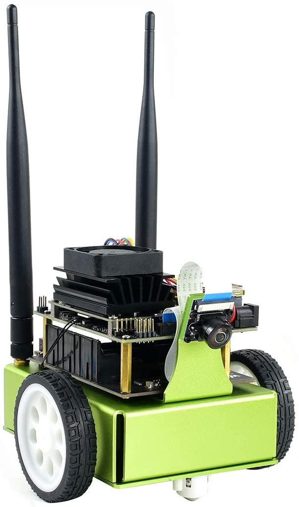

# Third Party Kits

In addition to the open-source DIY version, several third party JetBot kits using Jetson Nano have emerged.  This page details the kits that we're aware of

> Please note, we do not officially maintain these kits in this GitHub project.  Please refer to the vendor's documentation. Please refer to the vendor URL for cost and availability.  Some kits may have additional vendors that we aren't aware of or haven't listed yet.  If you think these would be helpful for other developers to know, please [let us know](../../issues).

## Waveshare JetBot

    

| Kit      | URL |
|----------|-----|
| WaveShare JetBot Kit |[Amazon.com](https://www.amazon.com/dp/B081LF98T8/), [Waveshare.com](https://www.waveshare.com/product/mini-pc/jetson/packages/jetbot-ai-kit-acce.htm), [Waveshare.net(中文)](https://www.waveshare.net/shop/JetBot-AI-Kit-Acce.htm) |
| WaveShare JetBot Kit (includes Jetson Nano Dev Kit) | [Amazon.com](https://www.amazon.com/dp/B081LCJXML/), [Waveshare.com](https://www.waveshare.com/product/mini-pc/jetson/packages/jetbot-ai-kit.htm), [Waveshare.net(中文)](https://www.waveshare.net/shop/JetBot-AI-Kit.htm) |
 

### Links
- [JetBot AI Kit Assemble Manual](https://www.waveshare.com/wiki/JetBot_AI_Kit_Assemble_Manual)
- [JetBot AI Kit](https://www.waveshare.com/wiki/JetBot_AI_Kit)
- [JetBot AI Kit (中文)](https://www.waveshare.net/wiki/JetBot_AI_Kit)

## SparkFun JetBot

    

| Kit      | URL |
|----------|-----|
| SparkFun JetBot AI Kit v2.1 | [SparkFun](https://www.sparkfun.com/products/15769) |
| SparkFun JetBot AI Kit v2.1 (includes Jetson Nano Dev Kit) | [SparkFun](https://www.sparkfun.com/products/16417) |
 

### Links
- [Assembly Guide for SparkFun JetBot AI Kit V2.0](https://learn.sparkfun.com/tutorials/assembly-guide-for-sparkfun-jetbot-ai-kit-v20)

## Seeedstudio JetBot

    

| Kit      | URL |
|----------|-----|
| Seeedstudio JetBot Smart Car Kit | [Seeedstudio](https://www.seeedstudio.com/Seeedstudio-JetBot-Smart-Car-Kit-p-4055.html) |
| Seeedstudio JetBot Smart Car Kit (includes Jetson Nano Dev Kit) | [Seeedstudio](https://www.seeedstudio.com/Seeedstudio-JetBot-Smart-Car-Powered-by-NVIDIA-Jetson-Nano-p-4054.htm) |
 

### Links
- [Seeedstudio JetBot Wiring Guide](https://github.com/SeeedDocument/Seeedstudio-Jetbot-Smart-Car/raw/master/res/Seeed%20JetBot%20wiring%20Guide.pdf)
- [Seeedstudio JetBot Setup Guide](https://github.com/SeeedDocument/Seeedstudio-Jetbot-Smart-Car/raw/master/res/Jetbot-snail.docx)

## Silicon Highway JetBot

    

| Kit      | URL |
|----------|-----|
| Silicon Highway JetBot Kit | [Silicon Highway (UK)](https://www.siliconhighwaydirect.co.uk/product-p/jetbot-kit.htm) |

 

### Links

## FaBo JetBot

    

| Kit      | URL |
|----------|-----|
| FaBo JetBot Kit (with Jetson Nano Dev Kit) | [FaBo store (Japan)](https://www.fabo.store/collections/jetbot/products/jetbot-kit) |

 

### Links

- [JetBot Kit チュートリアル](https://faboplatform.github.io/JetbotDocs/)

## GPUS JetBot

    

| Kit      | URL |
|----------|-----|
| GPUS JetBot Kit (with Jetson Nano Dev Kit) | [Taobao](https://item.taobao.com/item.htm?id=602196310625) |

 

### Links

  
