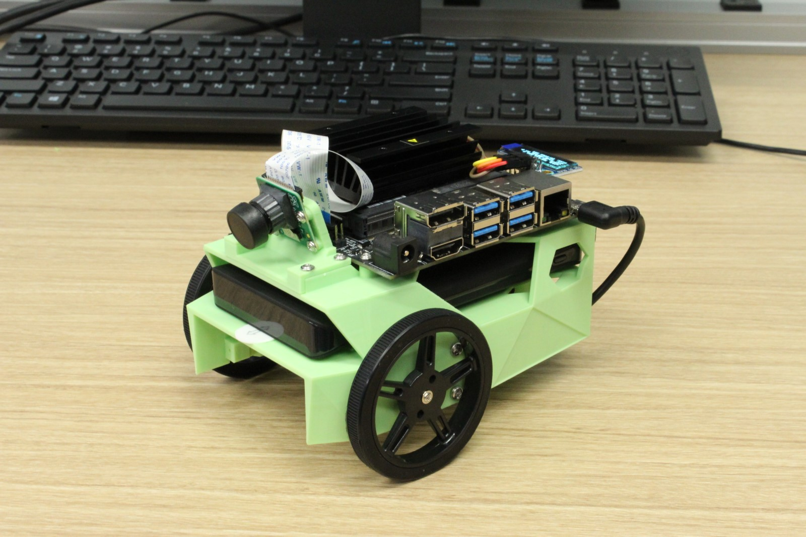

# Nvidia JetBot

NVIDIA JetBot is a DIY kit that costs
roughly $250 in parts *including* Jetson Nano.  Most parts are purchased
from popular online vendors, while a few parts like the Chassis
are 3D printed.  

## Instructions

To get started with the NVIDIA JetBot, follow these instructions.

1. Order the parts from the [bill of materials](bill_of_materials.md)

    > Some parts are 3D printed, we provide some tips in the [3D Printing page](3d_printing.md)
    
2. Assemble the robot by following the [hardware setup](hardware_setup.md)

3. Install the robot software by following the [software setup](software_setup.md)